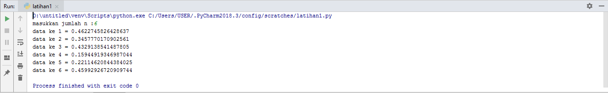
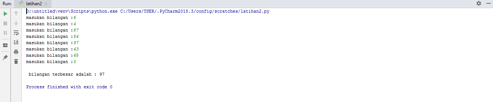
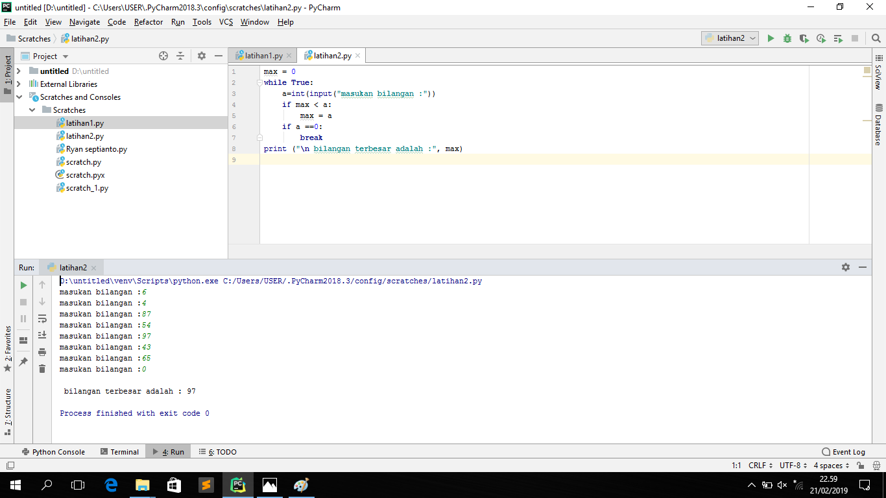

# praktikum4

# Latihan 1

# Program Sederhana Untuk Menampilkan N Bilangan Acak Yang Lebih Kecil Dari 0.5

## A. Algoritma Program Untuk Menampilkan N Bilangan Acak Yang Lebih Kecil Dari 0.5
1. Masukan Jumlah N pengulangan
2. Proses pengulangan sesuai jumlah pengulangan yang dinputkan
3. Tampilkan pengulangan dengan nilai di bawah 0.5
4. Selesai

Setelah anda menegetahui Algoritma Dalam sebuah Program Maka Langkah Berikutnya Kita Membuat Flowchartnya. Berikut ini Flowchart Program

# B. Flowchart Program

# C. Program Untuk Menampilkan N Bilangan Acak Yang Lebih Kecil Dari 0.5

## ==> Urutan Pembuatan Program

1. Ketikan Program *print ('Tampilkan n Bilangan Acak yang Lebih Kecil Dari 0.5')*
2. Ketikan Program *jumlah=int(input("Masukan Jumlah N : "))*
3. Ketikan Program *import random*
4. Ketikan Program *for i in range ( jumlah ) :*
5. Ketikan Program *print("Data ke", 1+i,"=>", (random.uniform(0.1,0.5)))* 

### ==> Penjelasan Alur Program

1. *print ('Tampilkan n Bilangan Acak yang Lebih Kecil Dari 0.5')* Untuk Menampilkan atau Mencetak kalimat Tampilkan N Bilangan Acak         yang Lebih Kecil Dari 0.5

2. *jumlah=int(input("Masukan Jumlah N : "))* Untuk menentukan jumlah input yang di inginkan sesuai tipe data yaitu interger tipe data      bilangan bulat

3. *import random**

4. *for i in range ( jumlah )* : Untuk Pengulangan dengan range jumlah

5. *print("Data ke", 1+i,"=>", (random.uniform(0.1,0.5)))* Untuk menampilkan atau mencetak urutan data sesuai jumlah inputan dengan        hasil di bawah 0.5

## D. Hasil

# Latihan 2

# Program Sederhana Untuk Menampilkan Bilangan Terbesar Dari N Buah Data Yang Dinputkan

## A. Algoritma Program Untuk Menampilkan Bilangan Terbesar Dari N Buah Data Yang Dinputkan

1. mulai
2. input bilangan N
3. Jika max < a maka akan lanjut pengulangan
4.Jika a==0 maka akan berhenti proses pengulangan
5. Dan mencetak hasil nilai maxium dari N yang di isikan
6. Selesai

Setelah anda menegetahui Algoritma Dalam sebuah Program Maka Langkah Berikutnya Kita Membuat Flowchartnya. Berikut ini Flowchart Program 

## B. Flowchart Program

C. Program Untuk Menampilkan Bilangan Terbesar Dari N Buah Data Yang Dinputkan

==> Urutan Pembuatan Program
Ketikan Program print ('Menampilkan Bilangan Terbesar Dari N Buah Data Yang Diinputkan')
Ketikan Program max= 0
Ketikan Program while true:
Ketikan Program a=int(input("Masukan Bilangan :"))
Ketikan Program if max < a
Ketikan Program max=a
Ketikan Program if a==0:
Ketikan Program break
Ketikan Program print("Bilangan Tebesar Adalah :", max)
==> Penjelasan Alur Program
print ('Menampilkan Bilangan Terbesar Dari N Buah Data Yang Diinputkan') Untuk menampilkan kalimat Menampilkan Bilangan Terbesar Dari N Buah Data Yang Diinputkan

max= 0 kode max disini untuk menentukan nilai max nya dalah 0

while true: Untuk perulangan hingga waktu yang tidak di tentukan atau selamanya

a=int(input("Masukan Bilangan :")) a untuk menginput tipe data interger ( bilangan bulat )

if max < a max=a jika max kurang dari a maka max = a

if a==0: break jika a= 0 maka akan berhenti dengan syarat break yang terpenuhi

print("Bilangan Tebesar Adalah :", max) Menampilkan *Bilangan Tebesar Adalah : Nilai maxiumnya

D. Hasil

Program 1
Program Sederhana Untuk Menghitung Jumlah Laba Hasil Investasi Seorang Pengusaha Selama 8 Bulan
A. Algoritma Program Untuk Menghitung Jumlah Laba Hasil Investasi Seorang Pengusaha Selama 8 Bulan
Mulai
Input modal misalkan x = 100.000.000 ( deklarasikan )
Input presentase untung a=0x, b=0x, c=0.01x, d=0.01x, e=0.05x, f=0.05x, g=0.05x, h=0.03x
For i in range (len (y)) pengulangan
Print (“laba bulan ke-“,i+1,”sebesar:” ,y[i])
Menghitung jumlah laba keseluruhan Z= (a+b+c+d+e+f+g+h)
Print (“jumlah laba selama 8 bulan adalah:”)
selesai

## B. Flowchart Program

# C. Program Untuk Menghitung Jumlah Laba Hasil Investasi Seorang Pengusaha Selama 8 Bulan

### ==> Urutan Pembuatan Program

1. Ketikan Program *print ('Jumlah Laba Hasil Investasi Seorang Pengusaha Selama 8 Bulan')*
2. Ketikan Program *x=100000000*
3. Ketikan Program *print (" Modal Awal:",x)*
4. Ketikan Program *a=0x, b=0x, c=0.01x, d=0.01x, e=0.05x, f=0.05x, g=0.05x, h=0.03x*
5. Ketikan Program *y=[a,b,c,d,e,f,g,h]*
6. Ketikan Program *For i in range (len (y))*
7. Ketikan Program *Print (“laba bulan ke-“,i+1,”sebesar:” ,y[i])*
8. Ketikan Program *Z= (a+b+c+d+e+f+g+h)*
9. Ketikan Program *Print (“jumlah laba selama 8 bulan adalah:”)*

### ==> Penjelasan Alur Program

1. *print ('Jumlah Laba Hasil Investasi Seorang Pengusaha Selama 8 Bulan')* Untuk Menampilkan kalimat *Jumlah Laba Hasil Investasi          Seorang Pengusaha Selama 8 Bulan*

2. *x=100000000* Dengan pemisalan atau dideklarasikan x adalah 100000000

3. *print (" Modal Awal:",x)* Menampilkan kalimat *Modal Awal : dan data yang berisi di x yaitu 100000000*

4. *a=0x, b=0x, c=0.01x, d=0.01x, e=0.05x, f=0.05x, g=0.05x, h=0.03x* Untuk Mendeklarasikan presentase laba tiap bulan dan di kali         dengan x  atau data inputan modal investasi yaitu 100000000

5. *y=[a,b,c,d,e,f,g,h]* untuk menentukan syarat y= yang berisi a,b,c,d,e,f,g,h

6. *For i in range (len (y)) Print (“laba bulan ke-“,i+1,”sebesar:” ,y[i])* untuk perulangan data dengan isi data yaitu Ydengan             menampilkan   urutan laba perbulan sesuai range yang di tentukan dengan hasil ke untukan yang di inpput dari data Y

7. *Z= (a+b+c+d+e+f+g+h) Print (“jumlah laba selama 8 bulan adalah:”)* Z berisi data penjumlahan data angka yang ada didalam kode             a,b,c,d,e,f,g,h yang akan di tampilakan atau dicetak di jumlah laba selama 8 bulan

## D. Hasil

