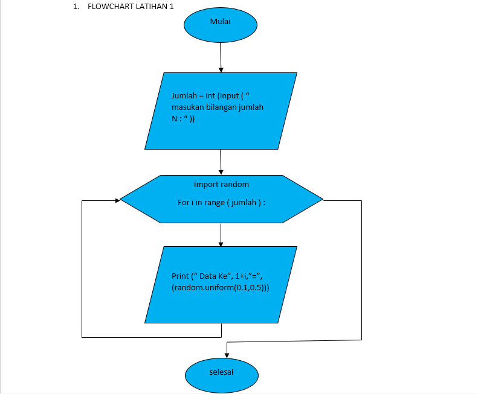

# praktikum4

# Latihan 1

# Program Sederhana Untuk Menampilkan N Bilangan Acak Yang Lebih Kecil Dari 0.5

## A. Algoritma Program Untuk Menampilkan N Bilangan Acak Yang Lebih Kecil Dari 0.5
1. Masukan Jumlah N pengulangan
2. Proses pengulangan sesuai jumlah pengulangan yang dinputkan
3. Tampilkan pengulangan dengan nilai di bawah 0.5
4. Selesai

Setelah anda menegetahui Algoritma Dalam sebuah Program Maka Langkah Berikutnya Kita Membuat Flowchartnya. Berikut ini Flowchart Program

# B. Flowchart Program

# C. Program Untuk Menampilkan N Bilangan Acak Yang Lebih Kecil Dari 0.5

## ==> Urutan Pembuatan Program

1. Ketikan Program *print ('Tampilkan n Bilangan Acak yang Lebih Kecil Dari 0.5')*
2. Ketikan Program *jumlah=int(input("Masukan Jumlah N : "))*
3. Ketikan Program *import random*
4. Ketikan Program *for i in range ( jumlah ) :*
5. Ketikan Program *print("Data ke", 1+i,"=>", (random.uniform(0.1,0.5)))* 

### ==> Penjelasan Alur Program

1. *print ('Tampilkan n Bilangan Acak yang Lebih Kecil Dari 0.5')* Untuk Menampilkan atau Mencetak kalimat Tampilkan N Bilangan Acak         yang Lebih Kecil Dari 0.5

2. *jumlah=int(input("Masukan Jumlah N : "))* Untuk menentukan jumlah input yang di inginkan sesuai tipe data yaitu interger tipe data      bilangan bulat

3. *import random**

4. *for i in range ( jumlah )* : Untuk Pengulangan dengan range jumlah

5. *print("Data ke", 1+i,"=>", (random.uniform(0.1,0.5)))* Untuk menampilkan atau mencetak urutan data sesuai jumlah inputan dengan        hasil di bawah 0.5

## D. Hasil

